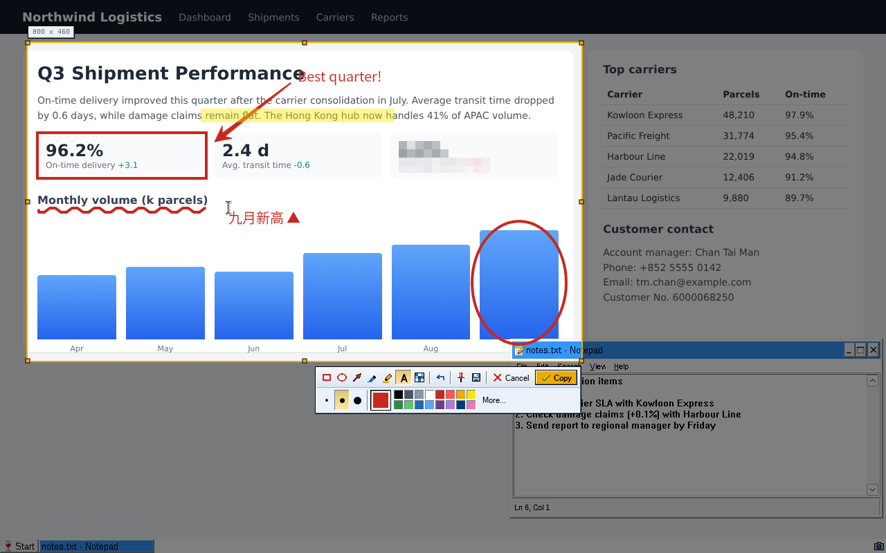

# RetroCap

A QQ-style screenshot and annotation tool for Windows 10 and 11, written in native .NET 8 (WPF).
Press **Ctrl+Alt+A** anywhere, pick a region, mark it up, and copy it to the clipboard.
The UI follows the [**Retro.Net design system**](https://github.com/owen800q/Retro.NET).




Demo video: [docs/demo.mp4](docs/demo.mp4) (recorded under Wine on Linux, so window chrome
around other apps looks like Wine rather than Windows 10).

## Features

- **Global hotkey** Ctrl+Alt+A (system tray app; single instance). If another program (QQ, WeChat)
  already owns the hotkey, the main window says so and you can capture from the window or tray icon.
- **Region selection** over every monitor: drag a rectangle, or click to take the highlighted
  window under the cursor. Eight resize handles, drag to move, arrow keys to nudge (Shift+arrow resizes).
- **Magnifier** with 4x pixel zoom, cursor position and the RGB/hex colour under the cursor.
- **Annotation tools**
  | Tool | Key | Notes |
  |---|---|---|
  | Rectangle | R | Shift = square |
  | Ellipse | E | Shift = circle |
  | Arrow | A | tapered QQ-style arrow; Shift snaps to 45° |
  | Pen | P | freehand |
  | Highlighter | H | translucent marker; Shift = straight line |
  | Text | T | supports Chinese/Japanese/Korean input |
  | Mosaic | M | pixelates whatever you paint over |
- **Three sizes and a 16-colour palette** per tool, plus **More...** for any custom colour.
- **Undo** (Ctrl+Z).
- **Output**: Copy (Enter / double-click / Ctrl+C), Save As PNG/JPG/BMP (Ctrl+S),
  **Pin to screen** (F3; drag to move, wheel to zoom, double-click to close).
  Optional auto-save of every copy to a folder.
- Esc cancels. Right-click backs out of the current selection.

## Download

Every push builds `RetroCap.exe` in GitHub Actions (**Actions → Build → Artifacts**).
Pushing a tag like `v1.0.0` attaches `RetroCap-win-x64.zip` and `RetroCap-win-arm64.zip`
to a GitHub Release. The exe is a self-contained single file, so you don't need to install .NET.

## Build locally

```powershell
dotnet publish src/RetroCap/RetroCap.csproj -c Release -r win-x64 -o dist
dist\RetroCap.exe
```

Command-line switches: `--tray` (start hidden in the notification area) and `--capture`
(start a capture immediately).

## Project layout

```
src/RetroCap/
  App.xaml(.cs)          startup, single instance, hotkey, tray
  MainWindow.xaml(.cs)   settings window (SAP window chrome)
  Capture/
    CaptureWindow.cs     full-screen overlay: selection, tools, output
    CaptureToolbar.xaml  floating SAP toolbar (tools, sizes, palette)
    Annotations.cs       rectangle / ellipse / arrow / pen / highlighter / mosaic / text
    Magnifier.cs         pixel loupe
  Services/              screen capture, hotkey, clipboard/save, settings, tray icon
  Theme/
    Theme.xaml           Retro SAP GUI tokens and control styles for WPF
    Icons.xaml           GENERATED from design/retro-sap-gui/icons.svg
  Ui/                    Bevel decorator, SapWindow chrome, pin window, toast
design/retro-sap-gui/    design-system tokens, component CSS, icon sprite
tools/                   gen_icons.py (SVG to XAML), gen_appicon.py (app.ico)
```

### Design system notes

- Tokens in `Theme/Theme.xaml` mirror `design/retro-sap-gui/colors_and_type.css`. Corners are
  always square and there are no shadows; depth comes from 1px two-tone bevels drawn by `Ui/Bevel.cs`.
  The single warm accent is SAP amber `#F0AB00`, used for the selection frame, the primary
  button and pressed tools.
- The icon sprite gained a class palette (the original left the classes uncoloured) and new
  capture icons: `tool-rect`, `tool-ellipse`, `tool-arrow`, `tool-pen`, `tool-highlighter`,
  `tool-text`, `tool-mosaic`, `pin` and `capture`. After editing `icons.svg`, run
  `python3 tools/gen_icons.py` (CI fails if `Icons.xaml` is out of date).
- The UI font is Microsoft Sans Serif, which ships with Windows.
